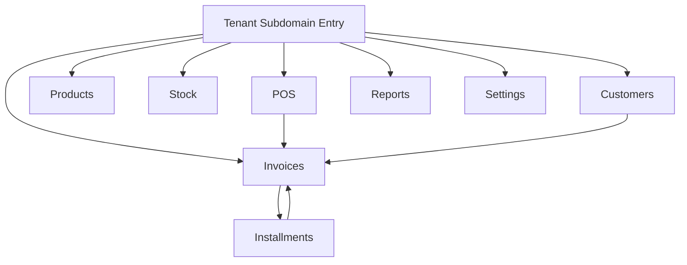

## 1. Product Overview
Storify Phase 1 MVP delivers core day-to-day retail operations for a single store/company.
You access the app via a tenant subdomain and manage sales, catalog, stock, customers, invoices, installments, reports, and settings.

## 2. Core Features

### 2.1 User Roles
| Role | Registration Method | Core Permissions |
|------|---------------------|------------------|
| Staff (Cashier/Clerk) | Provided by tenant admin (existing process) | Run POS, view products, create customers, create invoices, view limited reports |
| Manager/Admin | Provided by tenant admin (existing process) | Full access to products/stock/customers/invoices/installments/reports/settings; can approve installments (if enabled) |

### 2.2 Feature Module
Our Phase 1 MVP requirements consist of the following main pages:
1. **POS**: cart building, product search/barcode add, stock check, checkout, payment capture, invoice creation.
2. **Products**: product list, create/edit product, pricing, barcode/SKU.
3. **Stock**: current stock by product (and location if applicable), stock adjustments, stock movement history.
4. **Customers**: customer list, create/edit customer, customer details with invoices/installments.
5. **Invoices**: invoice list, invoice details, payment status, printable view.
6. **Installments**: create installment plan for an invoice, schedule tracking, payments posting, approval flow (if required).
7. **Reports**: sales summary, top products, receivables/installments summary, export.
8. **Settings**: tenant/store profile, taxes/fees/payment methods (as supported), user/role management (if supported by existing APIs).

### 2.3 Page Details
| Page Name | Module Name | Feature description |
|-----------|-------------|---------------------|
| POS | Tenant context | Resolve tenant from subdomain and scope all reads/writes to that tenant |
| POS | Product add/search | Search products by name/SKU/barcode; add to cart; edit quantities; remove items |
| POS | Stock validation | Validate available stock before checkout; show out-of-stock warning and prevent completion when required |
| POS | Checkout & payments | Select payment method; calculate totals; submit sale to REST API; handle success/failure states |
| POS | Invoice generation | Create invoice + line items; show confirmation and link to invoice details/print |
| Products | Product list | Browse/search/filter products; show price, SKU/barcode, stock indicator |
| Products | Product CRUD | Create/edit product fields required by API; validate required fields; save via REST API |
| Stock | Stock overview | Display on-hand quantity per product; support location/branch dimension if returned by API |
| Stock | Stock adjustments | Create stock in/out adjustments with reason; persist via REST API |
| Stock | Movement history | View stock movement log with filters (date, product, type) |
| Customers | Customer list | Browse/search customers; quick actions to create invoice / view details |
| Customers | Customer CRUD | Create/edit customer; validate required fields; save via REST API |
| Customers | Customer details | View profile + invoice history + installment status (read-only summary) |
| Invoices | Invoice list | Browse invoices; filter by date/status/customer; open invoice details |
| Invoices | Invoice details | View invoice header, items, totals, payments, balance; print/download if supported |
| Installments | Plan creation | Create installment plan for eligible invoice; submit to REST API; show schedule preview |
| Installments | Approval (if required) | Submit for approval; manager approves/rejects; update status via REST API |
| Installments | Schedule & payments | List installments; post installment payment; show remaining balance |
| Reports | Core dashboards | View sales summary, top products, receivables/installments summary based on API aggregates |
| Reports | Export | Export report results (CSV/PDF) when supported by API; otherwise download CSV from UI-generated data |
| Settings | Tenant/store settings | View/update store profile and business settings as supported by API |
| Settings | Payment/tax configuration | Configure payment methods/fees and tax settings if supported by API endpoints |
| Settings | Users & roles | Manage staff accounts/roles if supported by existing APIs; otherwise display read-only placeholders |

## 3. Core Process
Tenant access flow:
- You open the app using a tenant subdomain (e.g., `https://{tenant}.yourapp.com`).
- The frontend derives `tenantSubdomain` from the hostname and includes it on every REST API call (header or path, depending on the existing backend convention).
- All UI data shown in POS/products/stock/customers/invoices/installments/reports/settings is scoped to that tenant.

POS sale flow:
- You search/scan products, build a cart, and confirm quantities.
- The app validates stock via API, then submits checkout to create an invoice.
- On success, you see a confirmation with invoice number and a link to invoice details/print.

Installments flow:
- You open an invoice (or create via POS) and create an installment plan.
- If approval is required, a manager approves before the schedule becomes active.
- You post installment payments over time; invoice balance and receivables update in reports.

