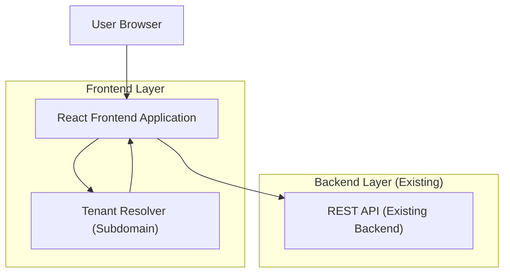

## 1.Architecture design


## 2.Technology Description
- Frontend: React@18 + TypeScript + react-router-dom + TanStack Query (or equivalent) + TailwindCSS
- Backend: Existing REST API service (no new backend required for Phase 1 MVP)

## 3.Route definitions
| Route | Purpose |
|-------|---------|
| /pos | Run checkout: cart, payment, invoice creation |
| /products | List/create/edit products |
| /stock | Stock overview, adjustments, movement history |
| /customers | List/create/edit customers |
| /customers/:id | Customer details (invoices + installments summary) |
| /invoices | Browse invoices |
| /invoices/:id | Invoice details + print/export if supported |
| /installments | Manage installment plans + payments + approvals (if enabled) |
| /reports | Sales/receivables summaries + export |
| /settings | Tenant/store configuration and staff/roles (if supported) |

## 4.API definitions (If it includes backend services)
### 4.1 Cross-cutting API contract (frontend expectations)
Tenant scoping:
- The frontend must resolve tenant from hostname: `tenantSubdomain = firstLabel(window.location.hostname)`.
- Every request must include tenant context using ONE of the following patterns (match your existing backend):
  - Header: `X-Tenant-Subdomain: {tenantSubdomain}` (recommended for single API host)
  - Path prefix: `/t/{tenantSubdomain}/...`
  - API host mapping: `https://{tenant}.api.yourapp.com/...`

Auth scoping (if your APIs require it):
- The frontend sends `Authorization: Bearer <access_token>`.

Error envelope (recommended frontend handling):
- Standardize on: `{ "success": boolean, "data": any, "error": { "code": string, "message": string } }`.

### 4.2 Shared TypeScript types (used by screens)
```ts
export type TenantContext = {
  subdomain: string;
};

export type Money = {
  currency: string;
  amount: number; // minor unit or decimal per backend contract
};

export type Product = {
  id: string;
  name: string;
  sku?: string;
  barcode?: string;
  unitPrice: number;
  isActive: boolean;
};

export type StockItem = {
  productId: string;
  onHand: number;
  locationId?: string;
};

export type Customer = {
  id: string;
  name: string;
  phone?: string;
  email?: string;
};

export type Invoice = {
  id: string;
  invoiceNo: string;
  customerId?: string;
  status: "draft" | "issued" | "paid" | "void";
  total: number;
  balance: number;
  createdAt: string;
};

export type InstallmentPlan = {
  id: string;
  invoiceId: string;
  status: "pending_approval" | "active" | "rejected" | "completed";
  total: number;
  balance: number;
};
```

### 4.3 REST endpoint mapping (adjust names to your existing APIs)
Products:
- `GET /products`
- `POST /products`
- `GET /products/:id`
- `PUT /products/:id`

Stock:
- `GET /stock` (optionally supports `?productId=&locationId=`)
- `POST /stock/adjustments`
- `GET /stock/movements`

Customers:
- `GET /customers`
- `POST /customers`
- `GET /customers/:id`
- `PUT /customers/:id`

POS / Invoices:
- `POST /pos/checkout` (creates invoice + items + payments per backend)
- `GET /invoices`
- `GET /invoices/:id`

Installments:
- `POST /installments` (create plan for invoice)
- `POST /installments/:id/approve` (if enabled)
- `POST /installments/:id/payments`
- `GET /installments`
- `GET /installments/:id`

Reports:
- `GET /reports/sales-summary`
- `GET /reports/top-products`
- `GET /reports/receivables`

Settings:
- `GET /settings`
- `PUT /settings`
- (optional) `GET /users`, `POST /users`, `PUT /users/:id` if staff management is API-backed

## 6.Data model(if applicable)
Not defined here because Phase 1 integrates with an existing REST API; the frontend relies on API contracts rather than direct database access.
